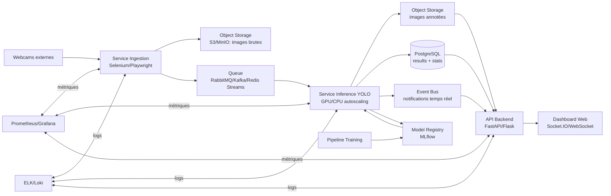

# Architecture de production proposée

## 1. Objectif
Mettre en production un système de détection `person`/`car` sur flux webcam, avec:
- ingestion continue des images,
- inférence proche temps réel,
- persistance des résultats,
- visualisation dashboard,
- observabilité (logs, métriques, alertes),
- et cycle MLOps (versionning, ré-entrainement, déploiement modèle).

## 2. Principes
- Découplage des services via file de messages.
- Services stateless autant que possible.
- Stockage séparé des images, métadonnées, et métriques.
- Déploiement reproductible (Docker + CI/CD).
- Monitoring applicatif + monitoring modèle.

## 3. Architecture cible (vue logique)

## 4. Composants
### 4.1 Ingestion
- Rôle: capturer périodiquement des snapshots webcam.
- Sorties:
  - image brute dans Object Storage,
  - message en queue (`camera_id`, `timestamp`, `image_uri`).
- Résilience:
  - retry exponentiel,
  - timeout par caméra,
  - circuit breaker par source.

### 4.2 Inference Service
- Consomme la queue, charge les modèles (`person`, `car`) depuis le registry.
- Produit:
  - image annotée,
  - détections (classe, score, bounding box),
  - agrégats par image.
- Expose métriques:
  - latence inférence,
  - débit images/s,
  - taux d'erreur,
  - distribution des scores.

### 4.3 Base de données
- **PostgreSQL** recommandé en prod (SQLite conservé pour dev).
- Tables minimales:
  - `detection_main` (image, datetime, nb objets, camera),
  - `detection_class` (classe, confidence, count),
  - `model_inference_log` (model_version, latency_ms, status).

### 4.4 API + Front
- API REST pour stats/filtrage.
- WebSocket pour push temps réel des nouvelles détections.
- Dashboard séparé du pipeline d'inférence (évite qu'un pic UI bloque le traitement).

### 4.5 MLOps
- Entraînement offline (batch) + suivi MLflow.
- Registry des modèles (stages: `Staging`, `Production`, `Archived`).
- Déploiement blue/green ou canary du modèle en inférence.

## 5. Déploiement production
- Orchestrateur: Kubernetes (ou Docker Swarm/Compose pour petite charge).
- Services:
  - `ingestion-service`,
  - `inference-worker`,
  - `api-service`,
  - `frontend-service`,
  - `postgres`,
  - `queue`,
  - `object-storage`.
- GPU node pool pour `inference-worker` (si disponible).
- Autoscaling sur CPU/GPU util + longueur de queue.

## 6. Monitoring & alerting (production)
### 6.1 Système
- CPU/RAM/GPU, redémarrages, saturation disque.
- Queue depth, backlog time.

### 6.2 Applicatif
- p95 latence API,
- p95 latence inférence,
- taux d'échec par service,
- disponibilité WebSocket.

### 6.3 Alertes minimales
- Queue backlog > seuil X min.
- Taux d'erreur inférence > 5% sur 10 min.
- Aucune image traitée depuis N minutes.
- API indisponible > 1 min.

## 7. Gestion de dérive modèle (option recommandée)
### 7.1 Détection de dérive
- **Data drift**: comparaison distribution features visuelles (embeddings, luminosité, densité objets) vs baseline d'entraînement.
- **Prediction drift**: variation du ratio classes (`person`/`car`), variation confiance moyenne.
- **Performance drift**: baisse mAP/precision sur échantillon annoté périodique (golden set).

### 7.2 Réponse à la dérive
- Alerte automatique si drift > seuil.
- Lancement pipeline de ré-entrainement.
- Validation offline + validation canary.
- Promotion du nouveau modèle si KPI >= modèle courant.

## 8. Sécurité & conformité
- Secrets dans Vault/K8s Secrets (pas de clé API en dur).
- Chiffrement en transit (TLS) et au repos (volumes DB/object storage).
- RBAC sur dashboard admin et endpoints sensibles.
- Journal d'audit des changements de modèle.

## 9. CI/CD recommandé
- CI:
  - tests unitaires,
  - tests intégration API,
  - lint/format,
  - scan sécurité image.
- CD:
  - build image versionnée,
  - migration DB,
  - déploiement canary,
  - rollback automatique si SLO cassé.

## 10. SLO/SLA proposés
- Disponibilité API: 99.5%.
- Latence API p95: < 500 ms.
- Latence inférence p95: < 2 s/image (cible, à calibrer selon hardware).
- Perte de messages queue: 0 (au moins une fois + idempotence).

## 11. Plan de transition depuis l'existant
1. Remplacer SQLite par PostgreSQL.
2. Introduire queue entre ingestion et inférence.
3. Externaliser stockage images vers S3/MinIO.
4. Containeriser services séparément (ingestion, inference, api, front).
5. Ajouter Prometheus/Grafana + logs centralisés.
6. Ajouter registry modèle et stratégie canary.

---

## Résumé
Cette architecture rend le système plus robuste, scalable et observable que l'exécution monolithique actuelle. Elle permet d'absorber plus de flux webcam, de suivre la qualité modèle en production, et de déployer des mises à jour modèle en sécurité.
